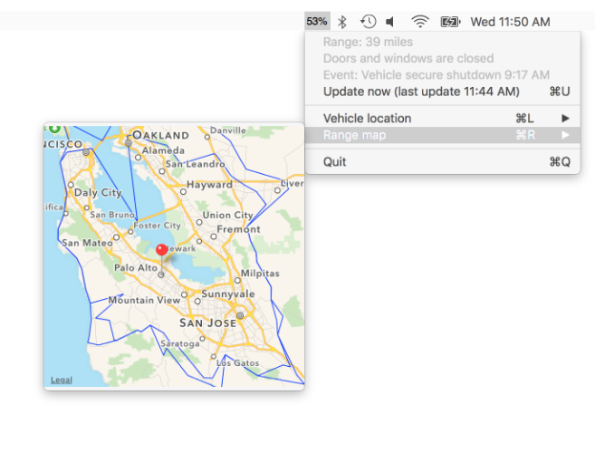

# ConnectedDrive

Access to the ConnectedDrive server for iOS, OSX and Apple TV apps. 
ConnectedDrive is based on [Edent's i-Remote API](https://github.com/edent/BMW-i-Remote) 

To use ConnectedDrive, you will need a valid ConnectedDrive account 
*and* the secret API key hidden in the original i-Remote app. To find the API key, see 
[authorization](https://github.com/edent/BMW-i-Remote#authorisation) or use [Charles Proxy](https://charlesproxy.com/).

Includes an OSX example menu bar app. 

